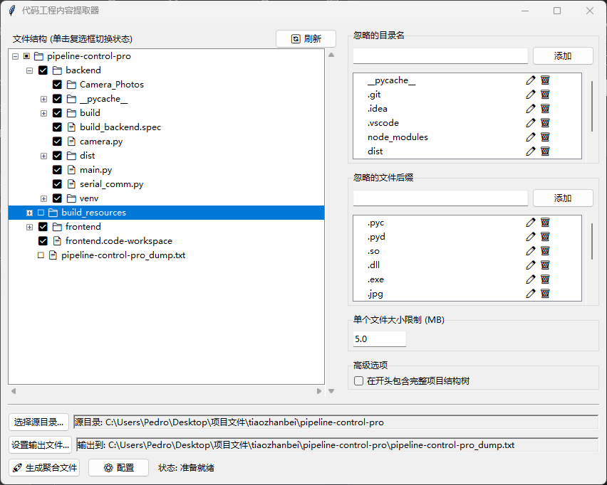

# CodeProject Zipper for AI

与 AI 协作编程时，它给出的代码总是和你的项目对不上号？这很常见。

## 问题所在

AI 助手很强大，但它们一次只能看到你发给它的那部分代码，对你整个项目的结构、依赖和上下文一无所知。结果就是，它可能会：
*   引用一个根本不存在的函数。
*   使用你项目里没有的库。
*   代码风格和你的项目格格不入。

这本质上是**上下文缺失**的问题。

这个小工具就是为了解决这个问题。它能将你的项目结构和选定的文件内容，“打包”成一个单一的 `.txt` 文件。你只需要把这个文件的内容复制粘贴给 AI，它就能获得理解你的项目所需的上下文，从而给出更靠谱的回答。

## 界面预览



## 主要功能

*   **图形化操作**：通过界面勾选文件，无需命令行。
*   **智能过滤**：
    *   可自定义需要忽略的目录名（如 `.git`, `node_modules`）和文件后缀。
    *   可设置单个文件的体积上限，避免打包过大的文件。
    *   自动跳过常见的二进制文件。
*   **输出结构树**：
    *   在输出文件顶部，会生成一份完整的项目结构树。
    *   同时也会生成一份你所选文件的结构树。
*   **编码自动检测**：尝试自动识别文件编码，避免中文等字符乱码。
*   **配置记忆**：能记住每个项目的过滤规则和文件勾选状态，方便下次使用。

## 如何使用

1.  运行程序。
2.  点击 **“选择源目录...”** 打开你的项目文件夹。
3.  在左侧文件树中，通过**复选框**勾选你想打包的文件。
4.  如果需要，在右侧面板中调整忽略规则。
5.  点击 **“🚀 生成聚合文件”**。
6.  程序会自动在文件管理器中为你定位到生成的 `.txt` 文件。
7.  打开它，复制全部内容，粘贴给 AI 即可。

## 如何运行

本项目依赖 `chardet` 库。

**安装依赖:**
```bash
pip install -r requirements.txt
```

**直接运行:**
```bash
python main.py
```